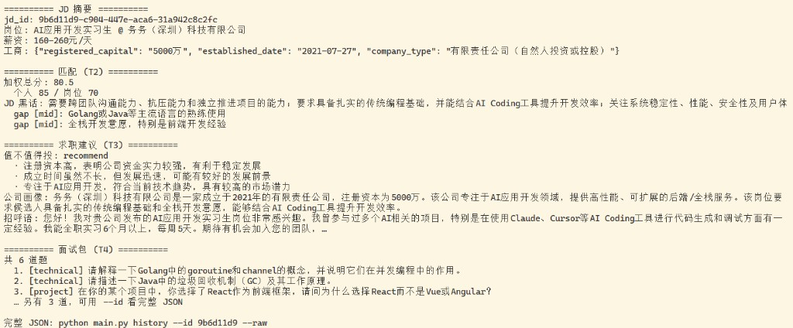
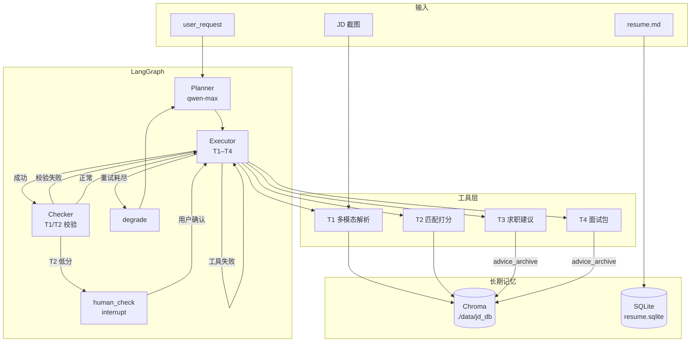

# JD Analysis Agent

输入招聘平台 **JD 截图 + 个人简历**，自动完成 **岗位匹配评分、求职建议生成与模拟面试准备**。基于 **LangGraph Agent** 架构，支持 LLM 动态规划、工具失败重试/重规划，以及低分岗位的确认式继续（human-in-the-loop）。

> 示例 JD 截图见 `test_images/`（脱敏/样例用途）。个人真实简历请使用本地 `resume.md`，**勿提交到仓库**。

### 运行效果



*上图：`python main.py history 1` 的可读摘要（匹配分、gap、建议与面试题预览）。完整 JSON 见下方「输出示例」。*

---

## 功能概览

| 步骤 | 工具 | 能力 |
|------|------|------|
| **T1** | JD 解析入库 | 多模态直读截图（Qwen-VL-Plus）→ 结构化 JD → 写入 Chroma 向量库 |
| **T2** | 简历匹配 | 个人/岗位二维打分（7:3 加权）+ gap 分析；检索历史相似 JD 辅助校准 |
| **T3** | 求职建议 | 招呼语、简历修改建议、沟通要点 |
| **T4** | 模拟面试包 | 模拟题 + 答案要点 + 准备建议 |
| **—** | **Checker** | T1/T2 产出字段校验：缺关键字段则自动重试；T1 仍缺则 interrupt 让用户补截图 |

**Checker 校验什么？** 在每次 `executor` 成功之后、进入下一步之前，按代码里定义的必填字段检查（非 LLM 主观打分）：

- **T1**：`job_title`、`tech_stack`、`requirements`、`responsibilities` 缺一不可；首次缺失自动重跑 T1 一次，仍缺则暂停并提示补截图  
- **T2**：`scores`、`gaps`、`weighted_total` 必须存在；缺失则回退重跑同一步（计入重试次数）  
- **T3/T4**：末端生成类输出，不做强校验  

**Planner** 根据自然语言请求动态选择工具链，例如：

```bash
python main.py --request "只帮我做匹配"          # 可能只跑 T1 + T2
python main.py --request "不要面试题"            # 可跳过 T4
```

---

## 架构



**三条控制流分支**（详见 [`docs/DECISIONS.md`](docs/DECISIONS.md)）：

1. **正常推进**：`executor` → `checker` → 下一步或结束  
2. **失败处理**：同一步最多重试 3 次 → `degrade` → Planner 带错误重出 plan（`replan_count` 上限 2）  
3. **Human-in-the-loop**：T2 加权总分 &lt; 60 → `interrupt` 询问是否继续 T3/T4  

---

## 技术栈

- **编排**：LangGraph（`StateGraph` + `MemorySaver` checkpointer）  
- **模型**：DashScope — `qwen-vl-plus`（T1）、`qwen-max`（Planner / T2–T4）、`text-embedding-v3`（JD 向量）  
- **存储**：Chroma（JD 库）、SQLite（简历版本链）  
- **Schema**：Pydantic v2（`schemas/jd.py`）  

---

## 快速开始

### 环境要求

- Python **3.11+**
- [DashScope API Key](https://dashscope.console.aliyun.com/)（环境变量 `DASHSCOPE_API_KEY`）

### 安装

```bash
git clone https://github.com/KUNNventure/jd-analysis-agent.git
cd jd-analysis-agent

python -m venv venv
# Windows
venv\Scripts\activate
# macOS / Linux
source venv/bin/activate

pip install -r requirements.txt
pip install chromadb   # JD 向量库依赖，需单独安装
```

### 配置

```bash
cp .env.example .env
# 编辑 .env，填入 DASHSCOPE_API_KEY

cp resume.template.md resume.md
# 编辑 resume.md 为你的真实简历（该文件已在 .gitignore 中，不会提交）
```

首次运行若简历库为空，会自动从 `resume.md` 导入；若只有模板，会提示你填写真实内容。

### 运行

```bash
# 默认：test_images/jd1.png + jd2.png，全流程分析
python main.py

# 指定 JD 截图（多张用英文逗号分隔）
python main.py --images test_images/jd1.png,test_images/jd2.png

# 自定义请求（传给 Planner）
python main.py --request "只帮我做匹配"

# 查看历史 JD 分析记录
python main.py history
python main.py history 1        # 最近一条详情
python main.py history 1 --raw  # 完整 JSON
```

**低分 / T1 缺字段时**，终端会 `interrupt` 暂停，按提示输入 `y`（继续）/ `n`（放弃），或补充截图路径。

### 简历库管理（可选）

```bash
python -m memory.resume_store init resume.md   # 手动导入简历
python -m memory.resume_store list           # 查看版本列表
```

---

## 项目结构

```text
jd-analysis-agent/
├── main.py              # CLI 入口（stream + interrupt 恢复）
├── agent/
│   ├── graph.py         # StateGraph 组装与条件路由
│   ├── nodes.py         # planner / executor / checker / degrade / human_check
│   ├── state.py         # AgentState（TypedDict）
│   └── step_summary.py  # 终端一步摘要
├── tools/
│   ├── jd_parser.py     # T1：Qwen-VL 多模态抽取
│   ├── jd_matcher.py    # T2：匹配打分 + 历史 JD 检索
│   ├── job_advisor.py   # T3：求职建议
│   ├── interview_prep.py# T4：模拟面试包
│   └── tool_defs.py     # T1–T4 节点 wrapper（写回 Chroma）
├── memory/
│   ├── jd_store.py      # Chroma JD 库（embed / 检索 / snapshot）
│   ├── resume_store.py  # SQLite 简历版本链
│   └── history.py       # 历史记录 CLI 展示
├── schemas/
│   └── jd.py            # JDStructured 数据模型
├── test_images/         # 示例 JD 截图
├── docs/
│   ├── DECISIONS.md     # 核心设计决策
│   └── images/          # README 演示截图（demo-terminal.png）
│   └── DEV_LOG.md       # 开发日志
├── resume.template.md   # 简历模板（可提交）
└── resume.md            # 本地真实简历（勿提交）
```

本地运行时会在 `./data/jd_db/` 生成 Chroma 与 SQLite 数据（已在 `.gitignore`）。

---

## 核心设计决策

完整论证见 [`docs/DECISIONS.md`](docs/DECISIONS.md)，此处摘录核心取舍：

| 决策 | 原因 |
|------|------|
| **LangGraph 而非 LangChain Chain** | 需要循环重试、条件分支、`interrupt` 断点续跑 |
| **Plan-Execute 而非 ReAct** | T1→T4 流程位置固定，ReAct 的逐步探索在此场景成本高、收益低 |
| **多模态直读，不走 OCR** | JD 版式杂乱，VL 一步理解职责/要求/标签区 |
| **自建 Chroma，不复用 RAG 管线** | 只需「整条存储 + 语义检索」，无需切片/重排/增强生成 |
| **T2 打分给模型、加权给 Python** | 判断交 LLM，算术留代码，权重/阈值可复现、可单测 |
| **历史 JD 参与 T2，不参与 T3/T4 检索** | `match_snapshot` 校准黑话与打分锚点；`advice_archive` 仅归档 |

**模型分级**：T1 用 `qwen-vl-plus`（结构化填空），Planner + T2–T4 用 `qwen-max`（推理与生成）。

---

## 输出示例

全流程跑完后，终端按 T1–T4 打印 JSON；日常查看推荐可读摘要：

```bash
python main.py history      # 列表
python main.py history 1    # 最近一条：匹配分、gap、招呼语、面试题预览
```

摘要示例（字段节选）：

```text
========== 匹配 (T2) ==========
加权总分: 80.5
  个人 85 / 岗位 70
  gap [high]: 后端开发经验

========== 求职建议 (T3) ==========
招呼语: 您好！我对贵公司发布的 AI 应用开发实习生岗位非常感兴趣…

========== 面试包 (T4) ==========
共 6 道题
  1. [technical] 请解释一下 Golang 中的 goroutine…
```

完整 JSON：`python main.py history 1 --raw`

---

## 当前版本边界与迭代方向

| 边界 | 说明 | 后续方向 |
|------|------|----------|
| **交互形态** | CLI，无 Web UI | 可选 Streamlit / 简单前端 |
| **匹配模型** | 个人:岗位 = 7:3；阈值 60 为 MVP 初值 | 通过 **Bad Case 回归集** 校准权重与阈值 |
| **公司评估** | T2 仅做人岗匹配；公司维度因缺用户偏好数据，**MVP 下沉至 T3 定性呈现**（`company_profile` / `company_viability`） | 接入用户偏好后可恢复公司维打分 |
| **会话断点** | `MemorySaver` 仅服务当次 interrupt | 跨会话历史已用 Chroma + SQLite 持久化 |

---

## 开发记录

按日迭代的实现笔记见 [`docs/DEV_LOG.md`](docs/DEV_LOG.md)。

---

## License

MIT
